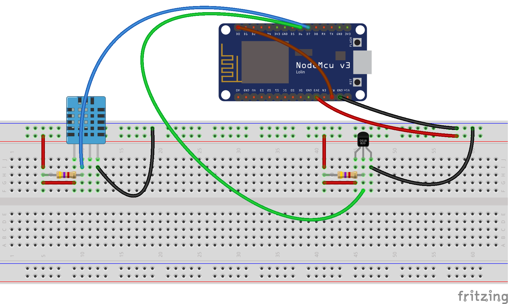

# sensorio-weather-station
Use the DHT22 and the DS18B20 sensor to get some weather informations and send it to an hub.

To use this code you need to install the following libraries:
* [DHT sensor library](https://github.com/adafruit/DHT-sensor-library)
* [OneWire library](https://github.com/PaulStoffregen/OneWire)
* [DallasTemperature library](https://github.com/milesburton/Arduino-Temperature-Control-Library)

You will need:
* 1 DHT sensor
* 1 DS18B20 sensor
* 2 resistor of 4Ω7
* 1 ESP-8266
* Some jumping wire