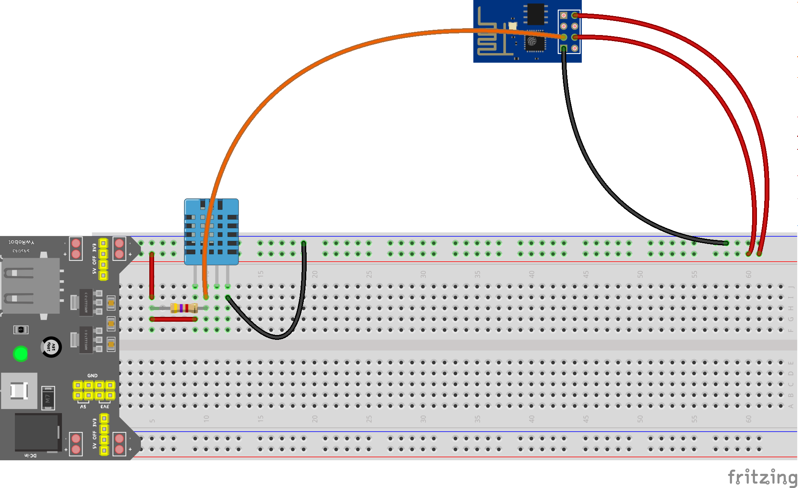

# sensorio-weather-station
Use the DHT22 and the DS18B20 sensor to get some weather informations and send it to an hub.
(You can also only use the DHT11 if you want to measure the temperature inside).

To use this code you need to install the following libraries:
* [DHT sensor library](https://github.com/adafruit/DHT-sensor-library)
* [OneWire library](https://github.com/PaulStoffregen/OneWire)
* [DallasTemperature library](https://github.com/milesburton/Arduino-Temperature-Control-Library)

## DHT22 and DS18B20
[Youtube video](https://www.youtube.com/watch?v=a8UGyteDqnM)

You will need:
* 1 DHT22 sensor
* 1 DS18B20 sensor
* 2 resistor of 4Ω7
* 1 ESP-8266
* Some jumping wire

## DHT11 only

[Youtube video](https://www.youtube.com/watch?v=qI2tW7DrRsk)

You will need:
* 1 DHT11 sensor
* 1 resistor of 4Ω7
* 1 ESP-8266
* Some jumping wire
